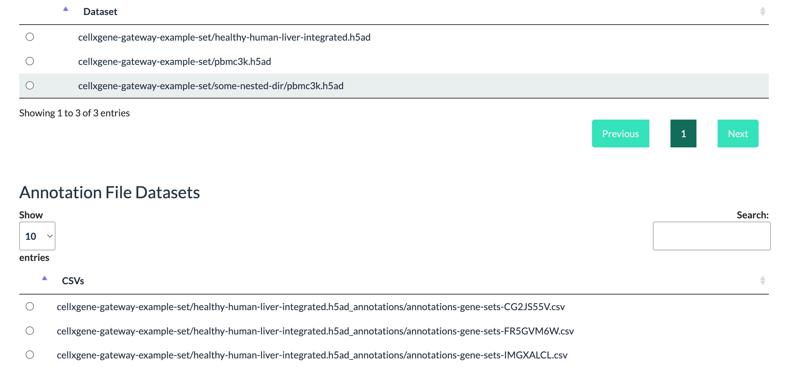
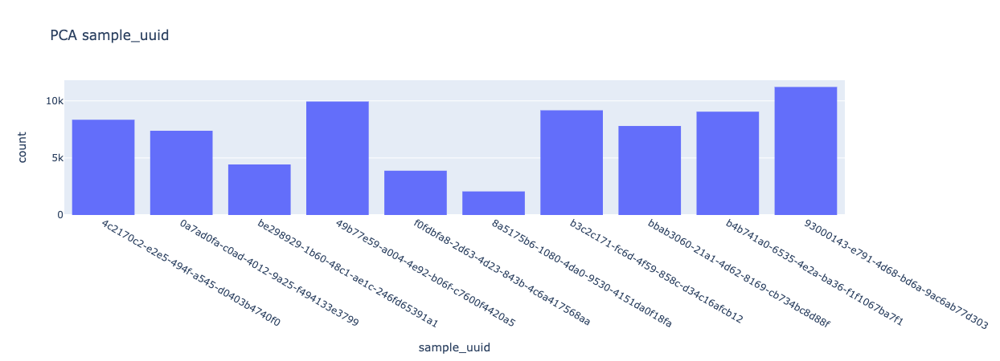
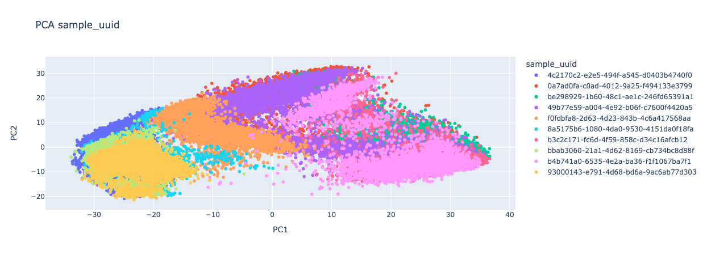
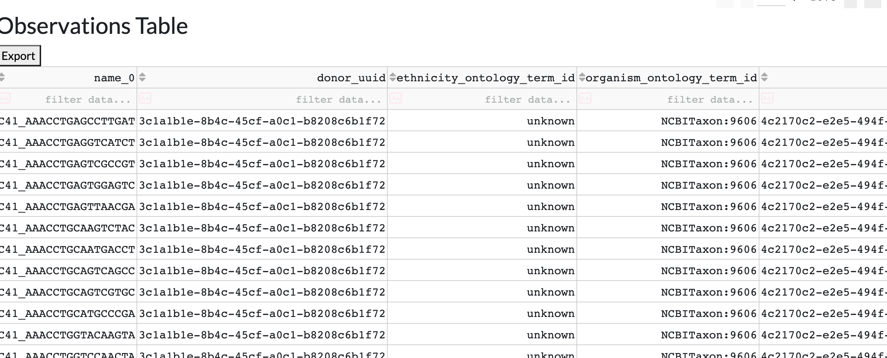
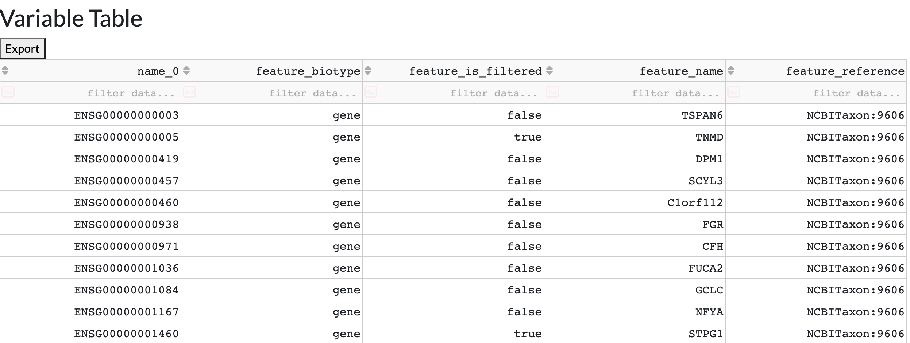
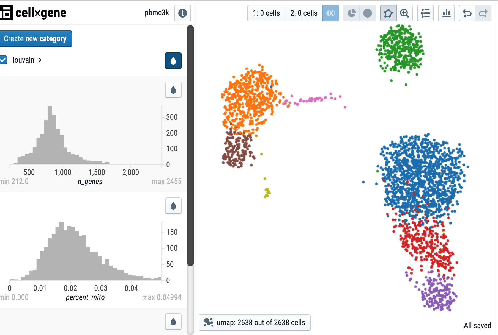

<!-- markdownlint-disable -->
# BioAnalyze - Single Cell Cloud Lab [](https://github.com/dabble-of-devops-bioanalyze/single-cell-cloud-lab-module/releases/latest)
<!-- markdownlint-restore -->


<!--


  ** DO NOT EDIT THIS FILE
  **
  ** This file was automatically generated by the `build-harness`.
  ** 1) Make all changes to `README.yaml`
  ** 2) Run `make init` (you only need to do this once)
  ** 3) Run`make readme` to rebuild this file.
  **
  ** (We maintain HUNDREDS of open source projects. This is how we maintain our sanity.)
  **


-->

Open-source **[Cloud Lab](https://www..bioanalyze.io)** for Single Cell Analysis.

---

This project is part of the ["BioAnalyze"](https://www.dabbleofdevops.com/biohub) project, which aims to make High Performance Compute Architecture accessible to everyone.


It's 100% Open Source and licensed under the [APACHE2](LICENSE).


## Data Science Infrastructure on AWS


## Introduction


- Cloud Native - Browse an S3 bucket and view your Single Cell data in [CellxGene](https://github.com/chanzuckerberg/cellxgene).
- Authentication enabled through [Flask AppBuilder](https://flask-appbuilder.readthedocs.io/en/latest/security.html) in the standalone version or [ShinyProxy](https://www.shinyproxy.io/documentation/configuration/) in the hosted version.
- Open source - Nothing is hidden behind a paywall.
- Self hosted and hosted with the AWS Marketplace (Coming Soon!) option.
- Download your PCA, TSNE, or UMAP plots for any dataset.

**Choose your Datasets from S3**



**Plot Views**

Plot your PCA, Umap, and/or TSNE with gene names or other observations.




**DataTable Views**

View, sort, filter and export your ScanPy dataframes.




**CellxGene**

[CellxGene](https://github.com/chanzuckerberg/cellxgene) is *an interactive explorer for single-cell transcriptomics data*.

Please note that I did not write CellXGene. Cellxgene is developed by the lovely folks over at the Chan Zuckerberg Initiave.




## ✨ Quick Start Self Hosted in `Docker`

> Get the code

```bash
git clone https://github.com/dabble-of-devops-bioanalyze/single-cell-cloud-lab
cd single-cell-cloud-lab
cp .env.sample .env
```

> Add your env vars

At a minimum you'll need AWS credentials and the S3 bucket where your scanpy datasets are stored.

```
SECRET_KEY=S3cr3t_K#Key
CELLXGENE_BUCKET="my-s3-bucket"
AWS_ACCESS_KEY_ID="1234"
AWS_SECRET_ACCESS_KEY="abcd"
AWS_DEFAULT_REGION=us-east-1
SYNC_ENABLED=True
# View without authentication
PUBLIC=True
```

If you have the `PUBLIC=True` in your env file you won't need to configure any authentication.

To configure authentication open the `config.py` and make any necessary changes.

> Start the app in Docker

```bash
docker-compose up --build
```

Visit `http://localhost:5005` in your browser. The app should be up & running.

## ✨ Quick Start  - AWS Marketplace

Coming Soon!## Quick Start

The `Makefile` is always the source of truth in any BioAnalyze project.

```
make compose/restart
```


## Examples


## Share the Love

Like this project? Please give it a ★ on [our GitHub](https://github.com/dabble-of-devops-bioanalyze/single-cell-cloud-lab)! (it helps **a lot**)


## Related Projects

Check out these related projects.

- [BioAnalyze Help Desk](https://dabbleofdevopshelp.zendesk.com/) - Home of the docs and help for the BioAnalyze Project.
- [BioAnalyze](https://www.bioanalyze.io) -
- [Dabble of DevOps Consulting](https://www.dabbleofdevops.com) - Want to hire me to design your HPC infrastructure?
- [terraform-aws-eks-cluster](https://github.com/cloudposse/terraform-aws-eks-cluster/) - Base CloudPosse module for AWS EKS Clusters"


## References

For additional context, refer to some of these links.

- [CellxGene](https://github.com/chanzuckerberg/cellxgene) - An interactive explorer for single-cell transcriptomics data
- [Scanpy](https://scanpy.readthedocs.io/) - Scanpy is a scalable toolkit for analyzing single-cell gene expression data built jointly with anndata. It includes preprocessing, visualization, clustering, trajectory inference and differential expression testing. The Python-based implementation efficiently deals with datasets of more than one million cells.

- [AnnData](https://anndata.readthedocs.io/) - anndata is a Python package for handling annotated data matrices in memory and on disk, positioned between pandas and xarray. anndata offers a broad range of computationally efficient features including, among others, sparse data support, lazy operations, and a PyTorch interface.

- [COVID-19 Cell Atlas](https://www.covid19cellatlas.org/) -


## Help

**Got a question?** We got answers.

File a GitHub [issue](https://github.com/dabble-of-devops-bioanalyze/single-cell-cloud-lab/issues), send us an jillian@dabbleofdevops.com.

## Bioinformatics Infrastructure on AWS for Startups

I'll help you build your data science cloud infrastructure from the ground up so you can own it using open source software. Then I'll show you how to operate it and stick around for as long as you need us.

[Learn More](https://www.dabbleofdevops.com)

Work directly with me via email, slack, and video conferencing.

- **Scientific Workflow Automation and Optimization.** Got workflows that are giving you trouble? Let's work together to ensure that your analyses run with or without your scientists being fully caffeinated.
- **High Performance Compute Infrastructure.** Highly available, auto scaling clusters to analyze *all the (bioinformatics related!) things*. All setups are completely integrated with your workflow system of choice, whether that is Airflow, Prefect, Snakemake or Nextflow.
- **Kubernetes and AWS Batch Setup for Apache Airflow** Orchestrate your Bioinformatics Workflows with Apache Airflow. Get full auditing, SLA, logging and monitoring for your workflows running on AWS Batch.
- **High Performance Compute Setup that Int** You'll have built-in governance with accountability and audit logs for all changes.
- **Docker Images** Get advice and hands on training for your team to build complex software stacks onto docker images.
- **Training.** You'll receive hands-on training so your team can operate what we build.
- **Questions.** You'll have a direct line of communication between our teams via a Shared Slack channel.
- **Troubleshooting.** You'll get help to triage when things aren't working.
- **Bug Fixes.** We'll rapidly work with you to fix any bugs in our projects.

## Contributing

### Bug Reports & Feature Requests

Please use the [issue tracker](https://github.com/dabble-of-devops-bioanalyze/single-cell-cloud-lab/issues) to report any bugs or file feature requests.

### Developing

If you are interested in being a contributor and want to get involved in developing this project or help out with other projects, I would love to hear from you! Shoot me an email at jillian@dabbleofdevops.com.

In general, PRs are welcome. We follow the typical "fork-and-pull" Git workflow.

 1. **Fork** the repo on GitHub
 2. **Clone** the project to your own machine
 3. **Commit** changes to your own branch
 4. **Push** your work back up to your fork
 5. Submit a **Pull Request** so that we can review your changes

#### Developer Notes

The `README.md` is created using the standard [CloudPosse](https://github.com/cloudposse/terraform-example-module) template that has been modified to use BioAnalyze information and URLs, and other documentation is generated using [jupyter-book](https://jupyterbook.org/).

Terraform code does not render properly when using the `literalinclude` directive, so instead we use `pygmentize` to render it to html which is included directly.

```
.. raw:: html
   :file: ./_html/main.tf.html
```

**NOTE:** Be sure to merge the latest changes from "upstream" before making a pull request!


## Copyrights

Copyright © 2021-2022 [Dabble of DevOps, SCorp](https://www.dabbleofdevops.com)


## License

[](https://opensource.org/licenses/Apache-2.0)

See [LICENSE](LICENSE) for full details.

```text
Licensed to the Apache Software Foundation (ASF) under one
or more contributor license agreements.  See the NOTICE file
distributed with this work for additional information
regarding copyright ownership.  The ASF licenses this file
to you under the Apache License, Version 2.0 (the
"License"); you may not use this file except in compliance
with the License.  You may obtain a copy of the License at

  https://www.apache.org/licenses/LICENSE-2.0

Unless required by applicable law or agreed to in writing,
software distributed under the License is distributed on an
"AS IS" BASIS, WITHOUT WARRANTIES OR CONDITIONS OF ANY
KIND, either express or implied.  See the License for the
specific language governing permissions and limitations
under the License.
```


## Trademarks

All other trademarks referenced herein are the property of their respective owners.


### Contributors

<!-- markdownlint-disable -->
|  [![Jillian Rowe][jerowe_avatar]][jerowe_homepage]<br/>[Jillian Rowe][jerowe_homepage] |
<!-- markdownlint-restore -->

  [jerowe_homepage]: https://github.com/jerowe
  [jerowe_avatar]: https://img.cloudposse.com/150x150/https://github.com/jerowe.png

Learn more at [Dabble of DevOps](https://www.dabbleofdevops.com)

## Sponsor

BioAnalyze is and will always be open source. If you've found any of these resources helpful, please consider donating to the continued development of BioAnalyze.

[Sponsor BioAnalyze](https://github.com/sponsors/dabble-of-devops-bioanalyze)

  [logo]: https://cloudposse.com/logo-300x69.svg
  [docs]: https://cpco.io/docs?utm_source=github&utm_medium=readme&utm_campaign=dabble-of-devops-bioanalyze/single-cell-cloud-lab&utm_content=docs
  [website]: https://cpco.io/homepage?utm_source=github&utm_medium=readme&utm_campaign=dabble-of-devops-bioanalyze/single-cell-cloud-lab&utm_content=website
  [github]: https://cpco.io/github?utm_source=github&utm_medium=readme&utm_campaign=dabble-of-devops-bioanalyze/single-cell-cloud-lab&utm_content=github
  [jobs]: https://cpco.io/jobs?utm_source=github&utm_medium=readme&utm_campaign=dabble-of-devops-bioanalyze/single-cell-cloud-lab&utm_content=jobs
  [hire]: https://cpco.io/hire?utm_source=github&utm_medium=readme&utm_campaign=dabble-of-devops-bioanalyze/single-cell-cloud-lab&utm_content=hire
  [slack]: https://cpco.io/slack?utm_source=github&utm_medium=readme&utm_campaign=dabble-of-devops-bioanalyze/single-cell-cloud-lab&utm_content=slack
  [linkedin]: https://cpco.io/linkedin?utm_source=github&utm_medium=readme&utm_campaign=dabble-of-devops-bioanalyze/single-cell-cloud-lab&utm_content=linkedin
  [twitter]: https://cpco.io/twitter?utm_source=github&utm_medium=readme&utm_campaign=dabble-of-devops-bioanalyze/single-cell-cloud-lab&utm_content=twitter
  [testimonial]: https://cpco.io/leave-testimonial?utm_source=github&utm_medium=readme&utm_campaign=dabble-of-devops-bioanalyze/single-cell-cloud-lab&utm_content=testimonial
  [office_hours]: https://cloudposse.com/office-hours?utm_source=github&utm_medium=readme&utm_campaign=dabble-of-devops-bioanalyze/single-cell-cloud-lab&utm_content=office_hours
  [newsletter]: https://cpco.io/newsletter?utm_source=github&utm_medium=readme&utm_campaign=dabble-of-devops-bioanalyze/single-cell-cloud-lab&utm_content=newsletter
  [discourse]: https://ask.sweetops.com/?utm_source=github&utm_medium=readme&utm_campaign=dabble-of-devops-bioanalyze/single-cell-cloud-lab&utm_content=discourse
  [email]: https://cpco.io/email?utm_source=github&utm_medium=readme&utm_campaign=dabble-of-devops-bioanalyze/single-cell-cloud-lab&utm_content=email
  [commercial_support]: https://cpco.io/commercial-support?utm_source=github&utm_medium=readme&utm_campaign=dabble-of-devops-bioanalyze/single-cell-cloud-lab&utm_content=commercial_support
  [we_love_open_source]: https://cpco.io/we-love-open-source?utm_source=github&utm_medium=readme&utm_campaign=dabble-of-devops-bioanalyze/single-cell-cloud-lab&utm_content=we_love_open_source
  [terraform_modules]: https://cpco.io/terraform-modules?utm_source=github&utm_medium=readme&utm_campaign=dabble-of-devops-bioanalyze/single-cell-cloud-lab&utm_content=terraform_modules
  [readme_header_img]: https://cloudposse.com/readme/header/img
  [readme_header_link]: https://cloudposse.com/readme/header/link?utm_source=github&utm_medium=readme&utm_campaign=dabble-of-devops-bioanalyze/single-cell-cloud-lab&utm_content=readme_header_link
  [readme_footer_img]: https://cloudposse.com/readme/footer/img
  [readme_footer_link]: https://cloudposse.com/readme/footer/link?utm_source=github&utm_medium=readme&utm_campaign=dabble-of-devops-bioanalyze/single-cell-cloud-lab&utm_content=readme_footer_link
  [readme_commercial_support_img]: https://cloudposse.com/readme/commercial-support/img
  [readme_commercial_support_link]: https://cloudposse.com/readme/commercial-support/link?utm_source=github&utm_medium=readme&utm_campaign=dabble-of-devops-bioanalyze/single-cell-cloud-lab&utm_content=readme_commercial_support_link
  [share_twitter]: https://twitter.com/intent/tweet/?text=BioAnalyze+-+Single+Cell+Cloud+Lab&url=https://github.com/dabble-of-devops-bioanalyze/single-cell-cloud-lab
  [share_linkedin]: https://www.linkedin.com/shareArticle?mini=true&title=BioAnalyze+-+Single+Cell+Cloud+Lab&url=https://github.com/dabble-of-devops-bioanalyze/single-cell-cloud-lab
  [share_reddit]: https://reddit.com/submit/?url=https://github.com/dabble-of-devops-bioanalyze/single-cell-cloud-lab
  [share_facebook]: https://facebook.com/sharer/sharer.php?u=https://github.com/dabble-of-devops-bioanalyze/single-cell-cloud-lab
  [share_googleplus]: https://plus.google.com/share?url=https://github.com/dabble-of-devops-bioanalyze/single-cell-cloud-lab
  [share_email]: mailto:?subject=BioAnalyze+-+Single+Cell+Cloud+Lab&body=https://github.com/dabble-of-devops-bioanalyze/single-cell-cloud-lab
  [beacon]: https://ga-beacon.cloudposse.com/UA-76589703-4/dabble-of-devops-bioanalyze/single-cell-cloud-lab?pixel&cs=github&cm=readme&an=single-cell-cloud-lab
